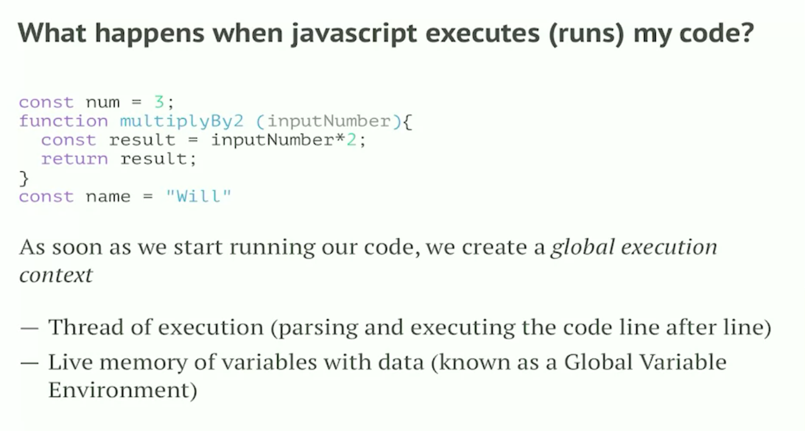
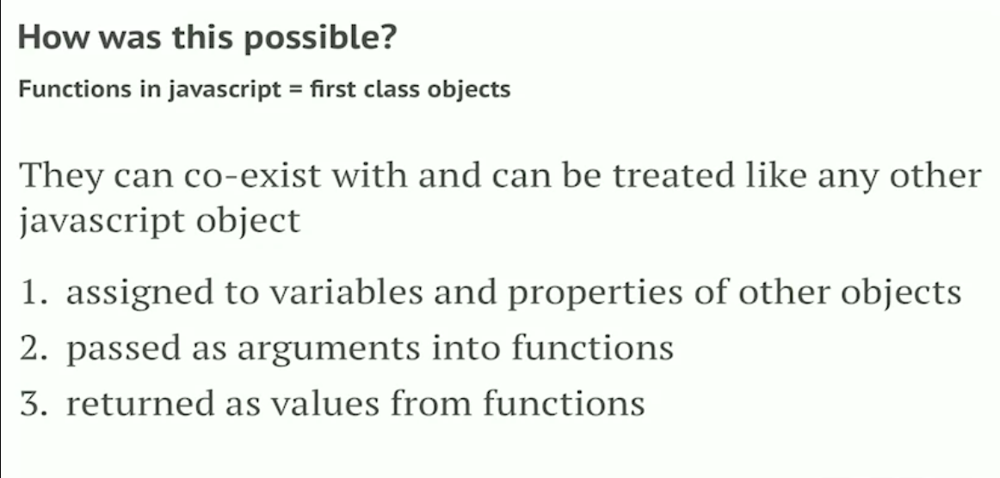
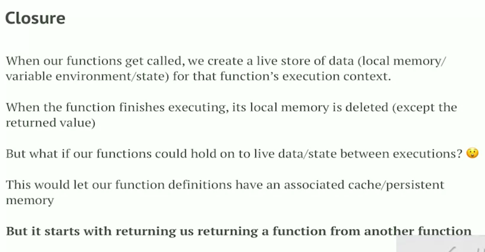

## Execution Context

What happens when engine runs the code. Every time a code runs engine creates a execution context.

* Single threaded (one thing at a time)
* Synchronous Execution (One after another)



Understanding global and local execution context.

When we start running the code we create Global Execution
```
const num = 42;
function square(number){
  const result = number * number;
  return result;
}
const userName = 'Harry Potter';
const fourSquare = square(4);
const eightSquare = square(8);
```

When we start executing the function we create the local execution. When the value is evaluated the local execution created will be deleted.

## Call Stack
It's a data structure which allows us to keep a track where the thread of execution is currently at. Top of the call stack shows the where the program is currently at.


## Callback
Functions are first class object in Javascript. We can pass objects as a paremeter in any function that means we can pass function as a parameter.




## Closure

```
function two() {
  function one(){
    console.log('One)
  }
  return one;
}
const callOne = two();
```

Second Example

```
functio outer(){
  const num = 0;
  function increment() {
    console.log(++num)
  }
  return increment;
}
const callOther = outer();
callOther();
callOther();
callOther();
```



Where you define your function determines what variables your function have access to when you call the function.


