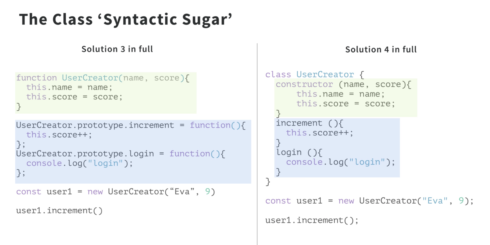

# This in Javascript

In oop when we define a method that will be called in context of different objects then we use this to refer it to the specifice object we called on.
 
## Rules to predice the value of 'this'

1. `user1.increment()` in function increment this point to the user1 object. This is also called a implicit parameter.

```js
function UserCreator(name, score){
  this.name = name;
  this.score = score;
}
UserCreator.prototype.increment = function(){
  function add1(){
    this.score++;
  }
  // const add1 = () => this.score++; // solution
	add1() }; // Rule 2
UserCreator.prototype.login = function(){
  console.log("login");
};
const user1 = new UserCreator(“Eva”, 9)
user1.increment()
```
2. If there is no object next to the function call it will point to the global. In browser it is 'window' and node it is 'global'

// 'this' in arrow function point to the object where the function was created i.e parent function.


## Default Prototype Chain

Example To check the properties in the object you can use the method 'hasOwnProperty' like
```js
const obj = {num: 43};
obj.hasOwnProperty("num")
```
These methods are predefined. Js uses its own prototypal nature for their own purpose.

```js
funnction multiply(a){
	return a * 2;
}
multiply.toString(); // Where it came from?
```

## Class in Javascript



## Subclassing in JS


## Controling the function with Call, Apply and Bind


